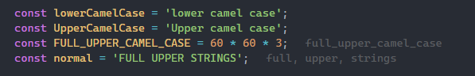

# To lowercase name

_✨ Use css cascade layers in Nuxt ✨_

**English** | [简体中文](./README.zh-CN.md)

A convenient tool for non-native English speakers, let those annoying all capital words take their original form!

## Features

- Automatically detect all uppercase words and convert them to lowercase to display in annotations after lines

;
